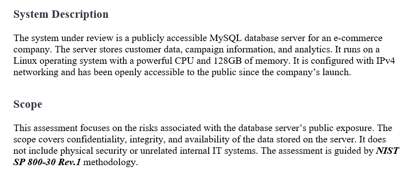
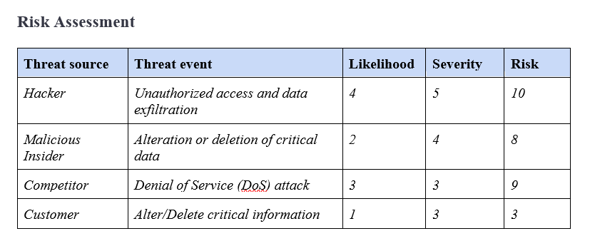
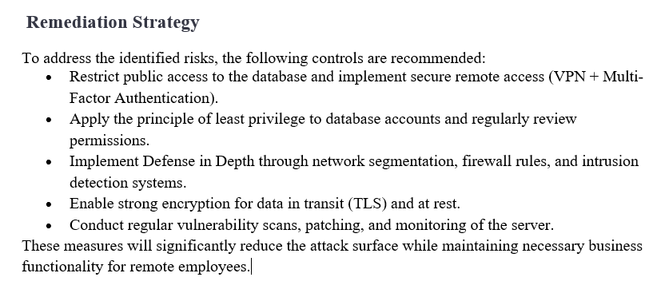
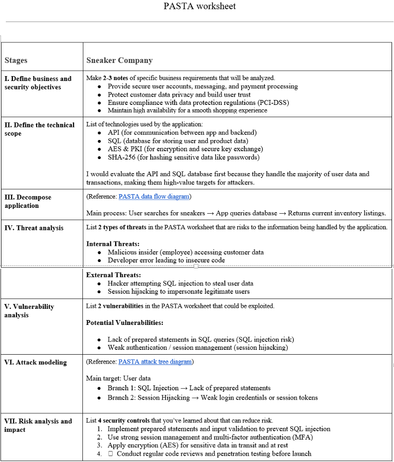
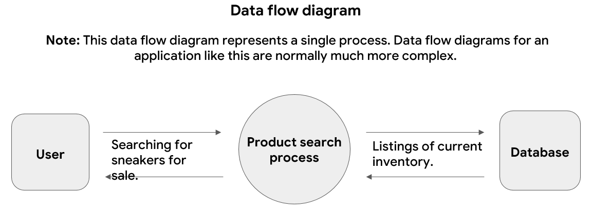
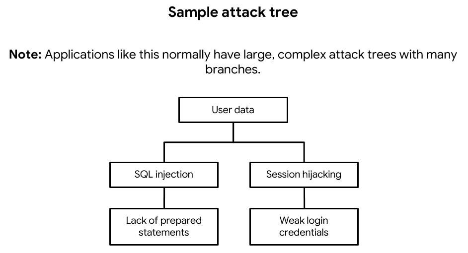

# Assets, Threats, and Vulnerabilities

**Project: Threat Modeling & Vulnerability Assessment**

This project was completed as part of **Course 5** of the Google Cybersecurity Professional Certificate. I performed asset analysis, threat modeling using the PASTA framework, and a vulnerability assessment for realistic business scenarios.

## Project Overview

I conducted two major activities:
- A vulnerability assessment for a publicly accessible database server
- A threat model using the PASTA framework for a new mobile shopping application

## Skills Demonstrated
- Asset identification and classification
- Threat modeling (PASTA framework)
- Vulnerability assessment and risk scoring
- Applying NIST SP 800-30 Rev. 1 methodology
- Creating security recommendations and remediation strategies

## Key Artifacts
- [Vulnerability-Assessment-Report.pdf](./Vulnerability-Assessment-Report.pdf)
- [PASTA-Threat-Modeling-Worksheet.pdf](./PASTA-Threat-Modeling-Worksheet.pdf)

## Screenshots & Evidence

### Vulnerability Assessment (E-commerce Database Server)

  
**System Description & Scope** – Analyzed a publicly accessible database server.

  
**Risk Assessment** – Identified threats, likelihood, severity, and overall risk scores.

  
**Remediation Strategy** – Recommended controls such as MFA, encryption, and least privilege.

### PASTA Threat Modeling (Sneaker Company Mobile App)

  
**PASTA Threat Model** – Applied all seven stages of the PASTA framework to evaluate a new mobile shopping application.

  
**Data Flow Diagram** – Analyzed how user data moves through the application.

  
**Attack Tree** – Modeled potential attack paths targeting user data.

## Key Learnings
- How to systematically identify assets, threats, and vulnerabilities
- Using structured frameworks (PASTA and NIST SP 800-30) for professional security analysis
- Translating technical findings into business-focused recommendations
- Importance of threat modeling early in the software development lifecycle

**Tools & Concepts Used:**
- PASTA Threat Modeling Framework
- NIST SP 800-30 Rev. 1 Risk Assessment
- Data Flow Diagrams & Attack Trees
- Qualitative Risk Scoring

---

[← Back to Main Portfolio](../README.md)
