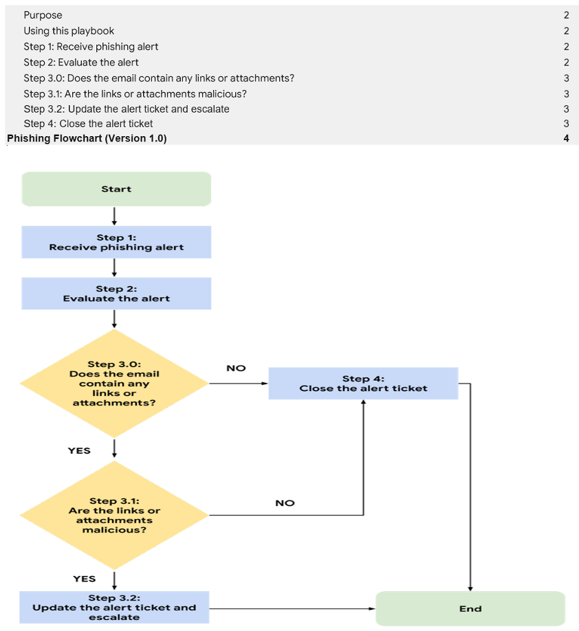
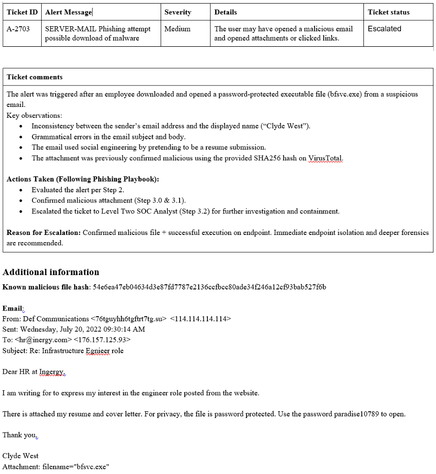
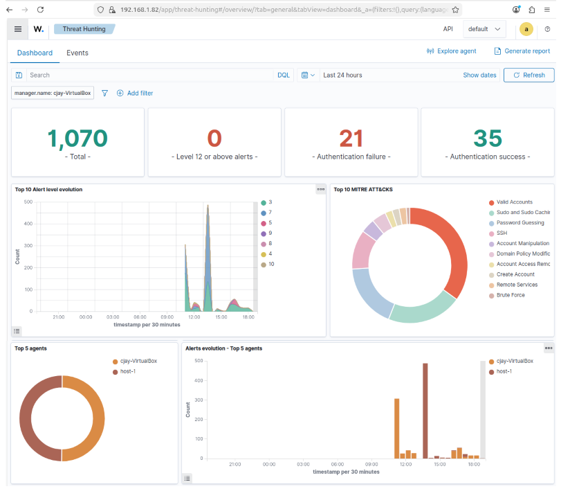
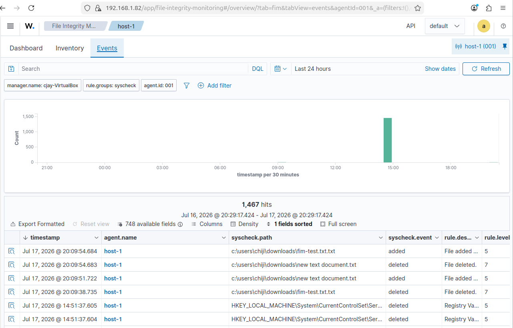
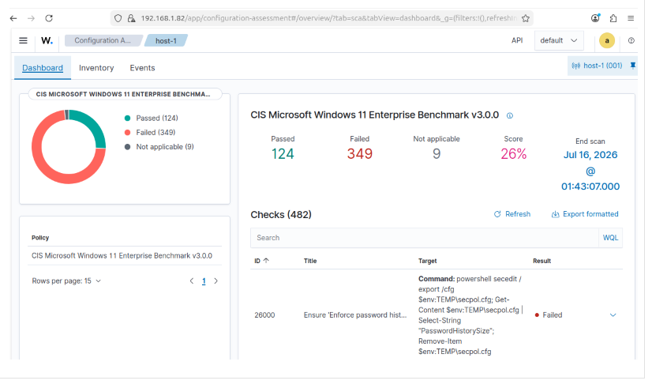
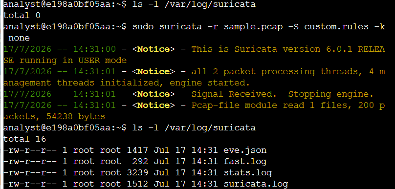
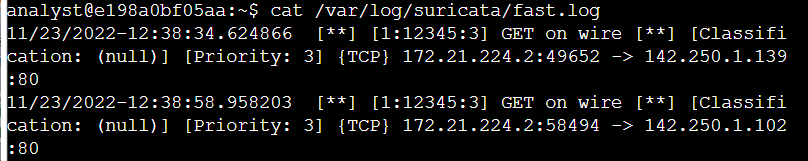
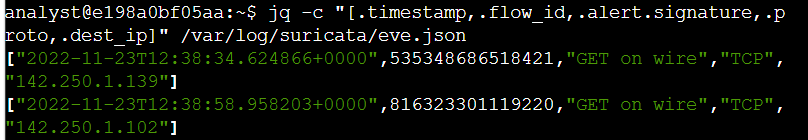

# Sound the Alarm: Detection and Response

**Project: Incident Response, Playbooks & Open Source Security Tools**

This portfolio project was completed as part of **Course 6** of the Google Cybersecurity Professional Certificate. I practiced incident detection, documentation, playbook usage, and hands-on work with open-source security tools.

## Project Overview

I responded to simulated ransomware and phishing incidents by:
- Maintaining an Incident Handler’s Journal
- Following a Phishing Playbook and Flowchart
- Evaluating alerts and escalating tickets
- Exploring intrusion detection and SIEM tools

## Skills Demonstrated
- Incident Response Lifecycle
- Playbook-driven investigation and escalation
- Alert analysis and ticketing
- Open-source IDS (Suricata) and SIEM (Wazuh)

## Key Artifacts
- [Incident-Handlers-Journal.pdf](./Incident-Handlers-Journal.pdf)
- [Phishing-Alert-Ticket.pdf](./Phishing-Alert-Ticket.pdf)

## Screenshots & Evidence

  
**Incident Handler’s Journal** – Documented multiple security incidents.

  
**Phishing Playbook Execution** – Followed structured steps to evaluate and escalate alerts.

  
**Escalated Alert Ticket** – Updated findings and escalated phishing case.

## Open Source Security Tools

### Wazuh (SIEM / XDR)

  
**Wazuh Dashboard** – Centralized security monitoring and alerting.

  
**File Integrity Monitoring (FIM)** – Detected changes to monitored files.

  
**Security Configuration Assessment** – Compliance scanning using CIS benchmarks.

### Suricata (Network Intrusion Detection System)

**Activity: Explore signatures and logs with Suricata**

  
**Custom Rule Execution** – Configured and triggered a custom Suricata rule.

  
**fast.log Analysis** – Reviewed real-time alerts with signatures, timestamps, and connection details.

  
**eve.json Output** – Analyzed detailed structured logs containing rich event metadata.

**Key Learnings from Suricata:**
- Signature-based threat detection in network traffic
- Understanding of different log formats (`fast.log` vs `eve.json`)
- How IDS tools like Suricata complement SIEM platforms

## Key Takeaways
- Importance of structured playbooks and clear documentation during incidents
- Value of open-source tools (Wazuh + Suricata) in building effective detection capabilities
- How to investigate, escalate, and document security events professionally

**Tools & Technologies:**
- Wazuh (SIEM + FIM + SCA)
- Suricata (Network IDS/IPS)
- Incident Response Playbooks
- Alert Ticketing

---

[← Back to Main Portfolio](../README.md)
