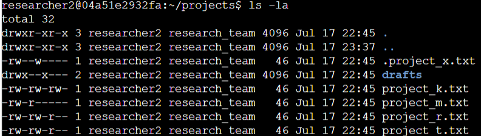
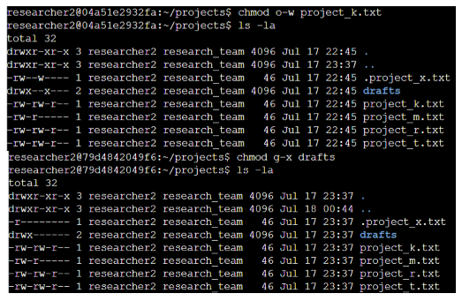
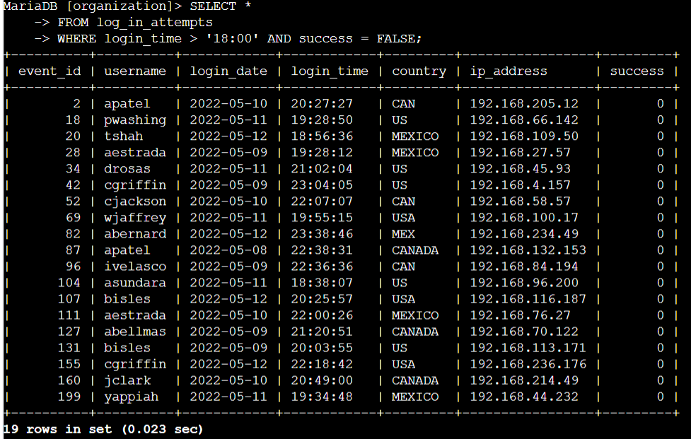
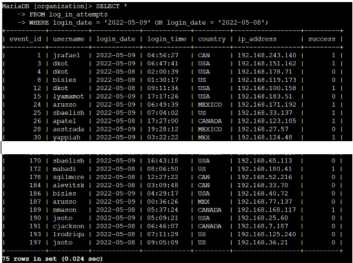
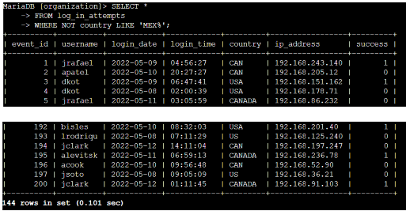
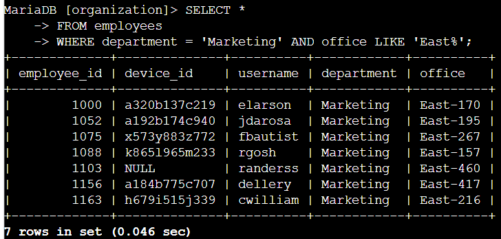

# Tools of the Trade: Linux and SQL

**Project: Linux Administration & SQL for Security Monitoring**

This project was completed as part of **Course 4** of the Google Cybersecurity Professional Certificate. I gained practical experience managing Linux file permissions and writing SQL queries to investigate security issues.

## Project Overview

I performed key security tasks including:
- Managing file and directory permissions on Linux systems
- Writing filtered SQL queries to analyze login attempts and employee data

## Skills Demonstrated

### Linux
- File and directory permission management (`ls -la`, `chmod`)
- Understanding of permission strings (10-character format)
- Working with hidden files
- Applying least privilege principles

### SQL
- Filtering with `AND`, `OR`, `NOT` operators
- Pattern matching with `LIKE` and wildcards (`%`)
- Querying multiple tables (`log_in_attempts` and `employees`)
- Extracting actionable security insights

## Key Artifacts

- [File-Permissions-Linux.pdf](./File-Permissions-Linux.pdf)
- [SQL-Security-Queries.pdf](./SQL-Security-Queries.pdf)

## Screenshots & Evidence

### Linux File Permissions

  
**File & Directory Details** – Used `ls -la` to inspect permissions and hidden files.

  
**Permission Changes** – Modified file and directory permissions using `chmod`.

### SQL Queries

  
**After Hours Failed Logins** – Filtered failed attempts after 18:00 using `AND`.

  
**Login Attempts on Specific Dates** – Used `OR` operator for multiple dates.

  
**Login Attempts Outside Mexico** – Used `NOT LIKE` for pattern filtering.

  
**Employees in Marketing** – Combined `AND` and `LIKE` for targeted results.

## Key Learnings
- How to securely manage file permissions on Linux systems using the principle of least privilege
- Writing effective SQL queries to investigate security events and support operational tasks
- Combining Linux and SQL skills for real-world security operations (permission auditing and log analysis)

**Tools & Technologies:**
- Linux Command Line (Ubuntu/CentOS)
- Bash Shell
- MariaDB / MySQL
- SQL filtering techniques

---

[← Back to Main Portfolio](../README.md)
