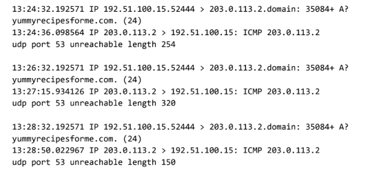
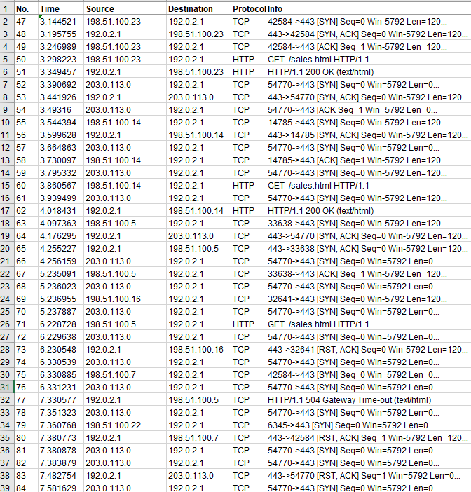
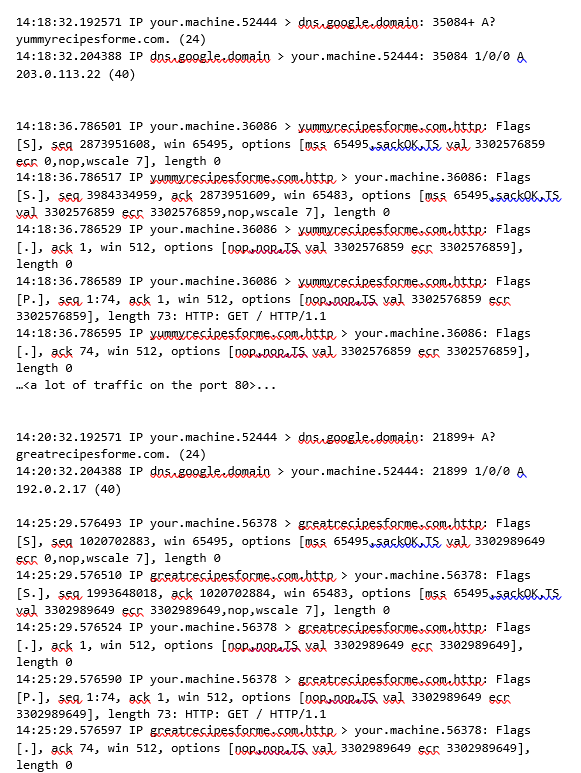
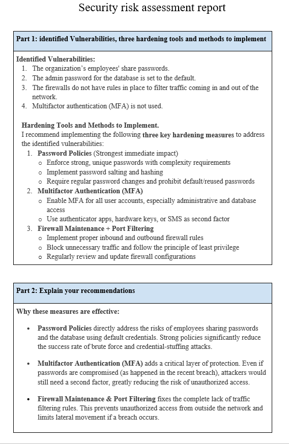

# Connect and Protect: Networks and Network Security
 
**Network Security Analysis, Attack Investigation & Hardening**  

## Project Overview
In this course, I analyzed network traffic, investigated real-world network attacks (SYN Flood and Brute Force + Malware), troubleshot connectivity issues, and provided network hardening recommendations to strengthen security posture.

## Key Activities & Skills Demonstrated

### 1. Network Traffic Analysis (DNS Issue)
- Used `tcpdump` to analyze packet captures
- Identified UDP port 53 (DNS) unreachability due to firewall or service issues
- Diagnosed "Destination port unreachable" errors

### 2. SYN Flood Attack Investigation
- Analyzed a Denial of Service (DoS) attack using TCP SYN flooding
- Explained the TCP three-way handshake and how it was exploited
- Recommended immediate mitigation and long-term hardening

### 3. Brute Force + Malware Incident Response
- Investigated a brute force attack followed by website compromise and malware distribution
- Identified HTTP and DNS protocols used in the attack chain
- Performed log analysis and malicious redirection tracking

### 4. Network Hardening & Risk Assessment
- Identified critical vulnerabilities (shared passwords, default credentials, no firewall rules, lack of MFA)
- Recommended strong password policies, MFA, and firewall maintenance
- Applied defense-in-depth principles

## Skills Demonstrated
- Packet capture and analysis using tcpdump
- Network protocol understanding (TCP, UDP, ICMP, DNS, HTTP)
- Identification and analysis of common network attacks
- Incident documentation and reporting
- Network hardening techniques and risk assessment
- Technical analysis with clear stakeholder communication

## Key Documents
- [SYN-Flood-Incident-Report.pdf](./SYN-Flood-Incident-Report.pdf)
- [Brute-Force-Malware-Incident-Report.pdf](./Brute-Force-Malware-Incident-Report.pdf)
- [DNS-Port53-Analysis.pdf](./DNS-Port53-Analysis.pdf)
- [Network-Hardening-Risk-Assessment.pdf](./Network-Hardening-Risk-Assessment.pdf)

## Screenshots & Evidence
  
**DNS Port 53 Unreachable Analysis**

  
**SYN Flood Attack Investigation**

  
**Brute Force + Malware Incident**

  
**Network Hardening Recommendations**

## Key Learnings
This course greatly improved my understanding of network protocols, attack vectors, and practical hardening techniques. I learned how small misconfigurations (like open ports or weak authentication) can lead to major security incidents, and how proper monitoring and controls can prevent them.

---
[← Back to Main Portfolio](../README.md)
