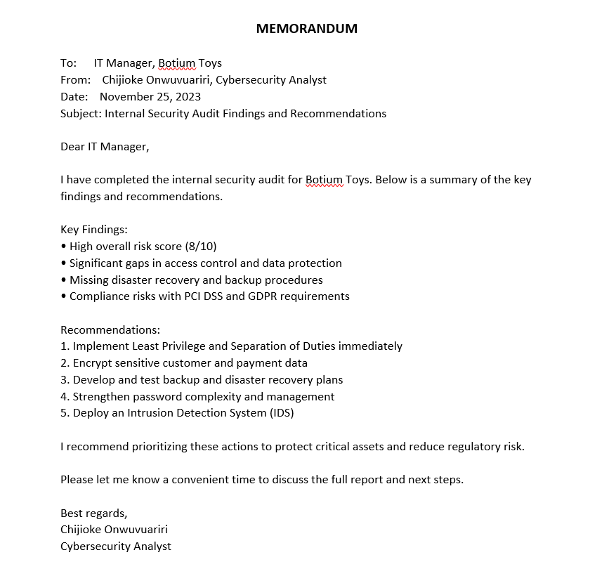
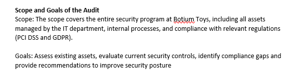
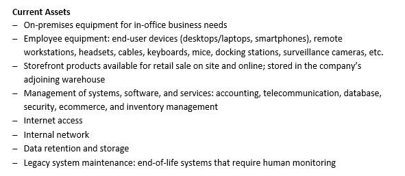
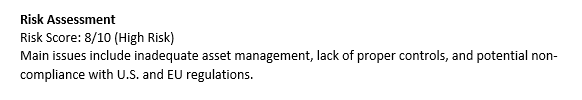
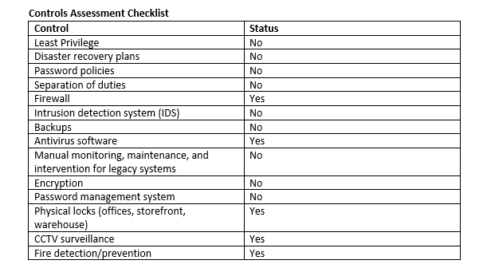
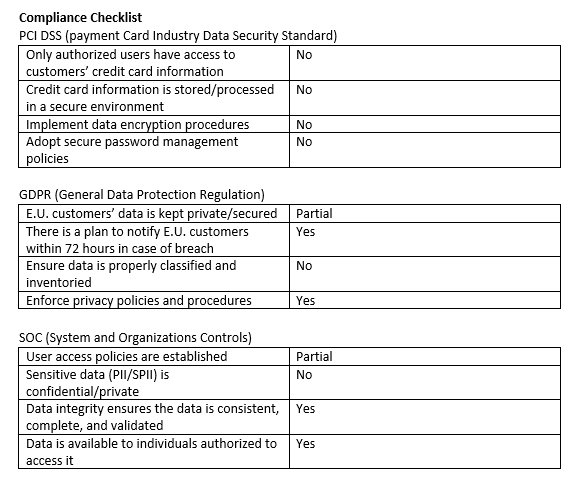

# Play It Safe: Manage Security Risks

**Project: Botium Toys Security Audit**

This is one of the main portfolio projects from **Course 2** of the Google Cybersecurity Professional Certificate. I conducted a full internal security audit for the fictional company Botium Toys.

## Project Overview

Botium Toys is a small business experiencing rapid online growth. The IT manager requested an internal audit to assess security posture, identify risks, evaluate controls, and ensure compliance with standards such as PCI DSS and GDPR.

## Skills Demonstrated
- Risk assessment using NIST Cybersecurity Framework
- Security controls evaluation (Administrative, Technical, Physical)
- Compliance checking (PCI DSS, GDPR, SOC)
- Professional stakeholder communication
- Audit documentation and reporting

## Key Documents

- [Botium-Toys-Security-Audit-Report.pdf](./Botium-Toys-Security-Audit-Report.pdf)
- [Controls-and-Compliance-Checklist.pdf](./Controls-and-Compliance-Checklist.pdf)
- [Stakeholder-Memorandum.pdf](./Stakeholder-Memorandum.pdf)

## Screenshots & Evidence

  
**Stakeholder Memorandum** – Professional summary and recommendations delivered to management.

  
**Audit Scope and Goals** – Clearly defined for Botium Toys’ IT infrastructure.

  
**Critical Assets Managed by IT Department** – Comprehensive asset inventory.

  
**Risk Assessment** – Overall risk score of 8/10 due to missing controls and asset management issues.

  
**Controls Assessment Checklist** – Identified gaps in least privilege, encryption, backups, and IDS.

  
**Compliance Checklist** – Notable gaps in PCI DSS and GDPR requirements.

## Key Learnings
This project helped me understand how to translate technical findings into business recommendations. It reinforced the importance of frameworks like NIST CSF and the need for both technical controls and clear documentation.

**Tools & Concepts Used:**
- NIST Cybersecurity Framework (CSF)
- Risk scoring (Likelihood & Impact)
- Control categories (Preventative, Detective, Corrective)
- Compliance standards (PCI DSS, GDPR)

---

[← Back to Main Portfolio](../README.md)
