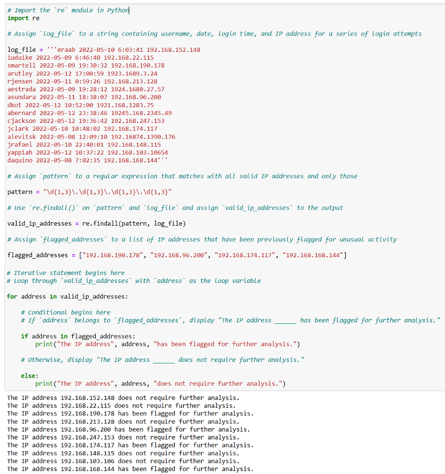
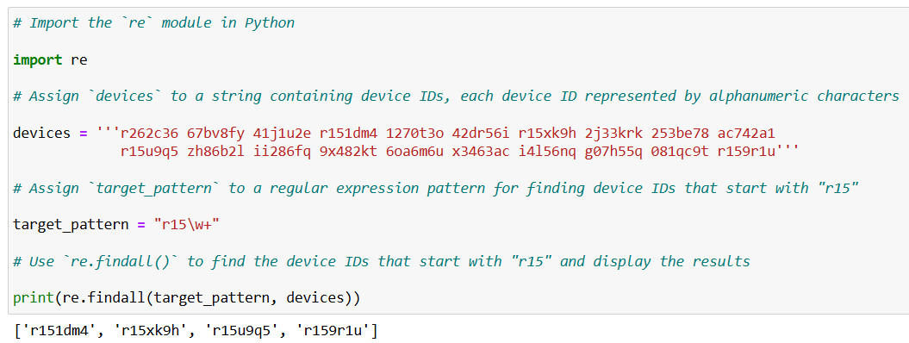
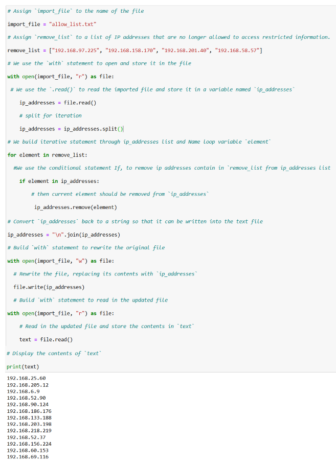
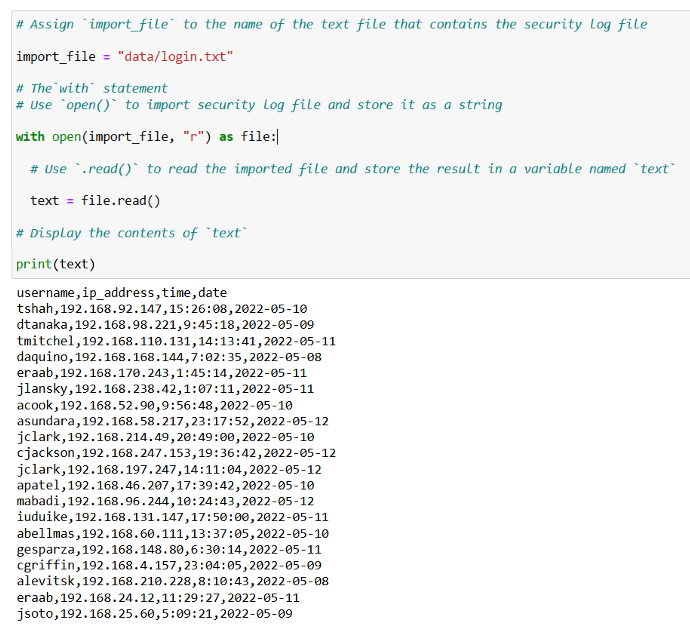

# Automate Cybersecurity Tasks with Python

**Project: Security Automation with Python**

This project was completed as part of **Course 7** of the Google Cybersecurity Professional Certificate. I developed Python scripts to automate key security tasks such as log analysis, access control updates, and pattern matching.

## Project Overview

I built practical automation scripts that help security teams reduce manual work and respond faster to potential threats.

## Key Scripts

- [`regex-log-analyzer.py`](./regex-log-analyzer.py) – Extracts IP addresses from logs and flags suspicious activity
- [`device-id-extractor.py`](./device-id-extractor.py) – Uses regex to identify devices needing updates
- [`update-files.py`](./update-files.py) – Automates updating allow lists by removing unauthorized IPs
- [`log-file-parser.py`](./log-file-parser.py) – Reads and structures security log data

## Screenshots & Evidence

  
**IP Extraction & Analysis** – Used regular expressions to detect and flag suspicious IPs.

  
**Device Pattern Matching** – Identified devices starting with "r15" for patching.

  
**Allow List Maintenance** – Automated removal of unauthorized IP addresses.

  
**Log Parsing** – Read and processed security logs.

## Key Learnings
- Efficient use of the `re` module for pattern matching in logs
- Automating file updates and access control maintenance
- Parsing and analyzing security logs to support incident response
- Writing clean, reusable, and well-documented Python code

**Tools & Technologies:**
- Python 3
- `re` module (Regular Expressions)
- File I/O operations

---

[← Back to Main Portfolio](../README.md)

```# Assign `import_file` to the name of the text file that contains the security log file

import_file = "data/login.txt"

# The`with` statement
# Use `open()` to import security log file and store it as a string

with open(import_file, "r") as file:

  # Use `.read()` to read the imported file and store the result in a variable named `text`

  text = file.read()

# Display the contents of `text`

print(text)```
