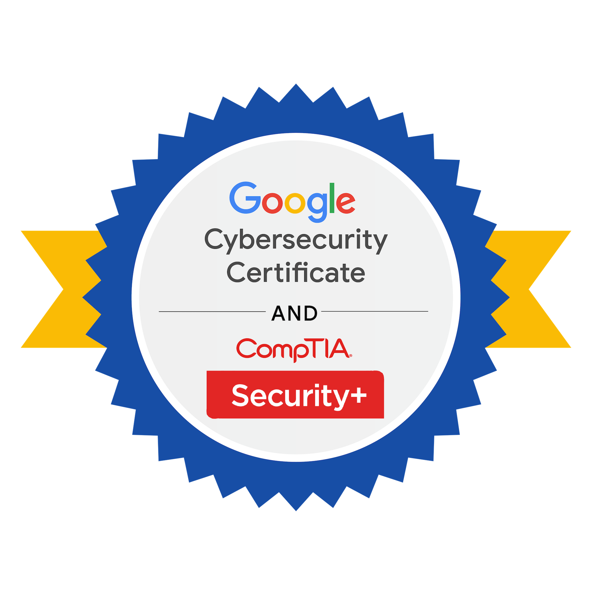

# Cybersecurity Portfolio | CHIJIOKE ONWUVUARIRI

  

**Aspiring Cybersecurity Analyst** | Google Cybersecurity Professional Certificate + CompTIA Security+ Certified

## About Me
I hold the **Google Cybersecurity Professional Certificate** and **CompTIA Security+** certification. Through intensive hands-on labs, I gained practical experience in risk assessment, network security, incident response, Linux administration, SQL querying, and Python automation.

This portfolio showcases real projects and artifacts from the Google program, demonstrating my readiness for entry-level cybersecurity roles.

## Key Certifications
- **CompTIA Security+** (SY0-701)
- **Google Cybersecurity Professional Certificate**

## Key Skills
- Threat Detection & Incident Response
- Security Auditing & Risk Assessment
- Network Security & Hardening
- Linux Administration & Bash
- SQL for Security Monitoring
- Python Scripting & Automation (Regex, File Handling, Log Analysis)
- SIEM Concepts & Packet Analysis
- NIST Frameworks & Security Controls

---

## 📂 Portfolio Projects

### [Course 2] Play It Safe: Manage Security Risks
**Security Audit – Botium Toys Case**  
Conducted risk assessment, compliance checklist, and stakeholder recommendations.  
[View Project →](./PlayItSafe_ManageSecurityRisks/)

### [Course 3] Connect and Protect: Networks and Network Security
**Network Security Analysis & Hardening**  
Analyzed attacks (SYN Flood, Brute Force) and recommended network defenses.  
[View Project →](./Networks_NetworkSecurity/)

### [Course 4] Tools of the Trade: Linux and SQL
**Linux & SQL Security Tasks**  
Managed file permissions and applied SQL filters for security investigations.  
[View Project →](./Linux_SQL/)

### [Course 5] Assets, Threats, and Vulnerabilities
**Threat Modeling & Vulnerability Assessment**  
Performed vulnerability assessment and PASTA threat modeling.  
[View Project →](./Assets_Threats_Vulnerabilities/)

### [Course 6] Sound the Alarm: Detection and Response
**Incident Response & SIEM Analysis**  
Developed incident journals, playbooks, and worked with Wazuh & Suricata.  
[View Project →](./Detection_Response/)

### [Course 7] Automate Cybersecurity Tasks with Python
**Python Automation for Security**  
Built scripts for log parsing, regex analysis, file updates, and device identification.  
[View Project →](./Python_Automation/)

---

## 🛠️ Tools & Technologies
- **OS & CLI:** Linux, Bash
- **Languages:** Python, SQL
- **Security Tools:** Wireshark, tcpdump, Wazuh, Suricata
- **Frameworks:** NIST, CIA Triad, CompTIA Security+ domains
- **Others:** Git, Regular Expressions, Virtual Machines

---

## Resume & Credentials
- **[Download Resume (PDF)](./resume.pdf)**
- **[Google Cybersecurity Professional Certificate](link-to-your-certificate)**
- **[CompTIA Security+ Certification](link-to-credly)**

---

## Contact & Connect
- **Email:** [chijiokeon@gmail.com](mailto:chijiokeon@gmail.com)
- **LinkedIn:** [linkedin.com/in/chijioke-onwuvuariri-387668106](https://linkedin.com/in/chijioke-onwuvuariri-387668106)
- Open to entry-level **Cybersecurity Analyst / SOC Analyst** opportunities.

---

## Acknowledgments
This portfolio was built as part of the Google Cybersecurity Professional Certificate program. All projects are based on hands-on labs and scenarios.

*Last updated: July 2026*
